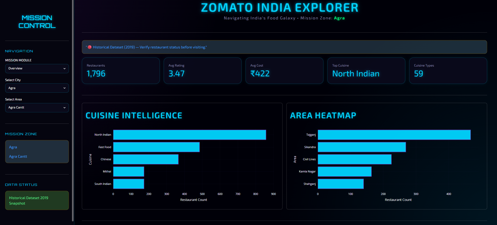
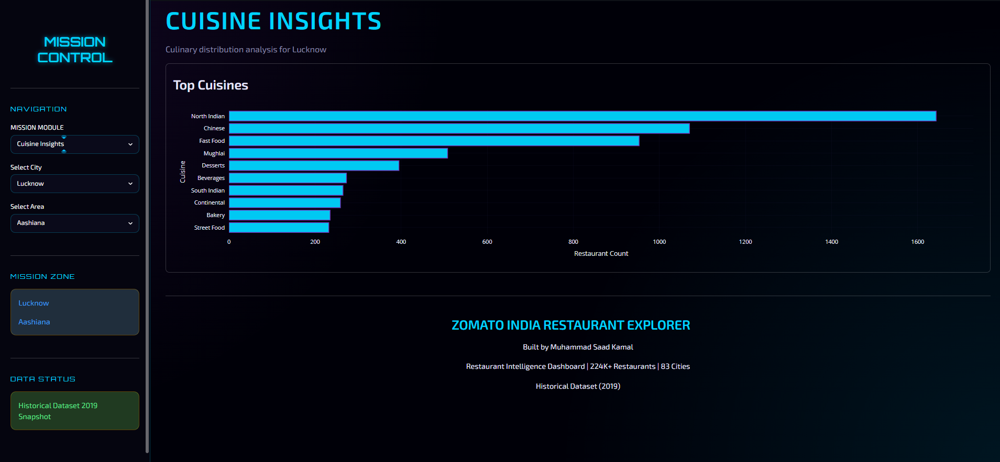
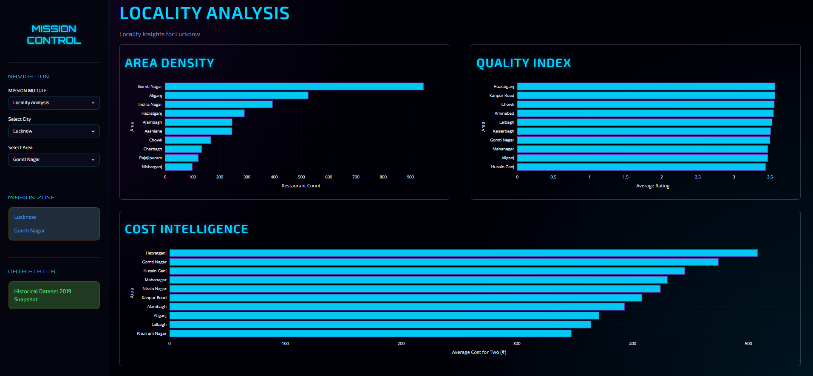
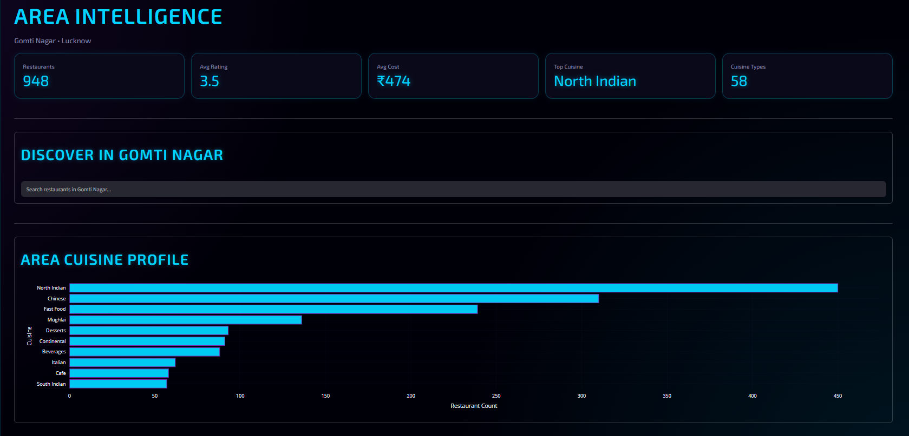
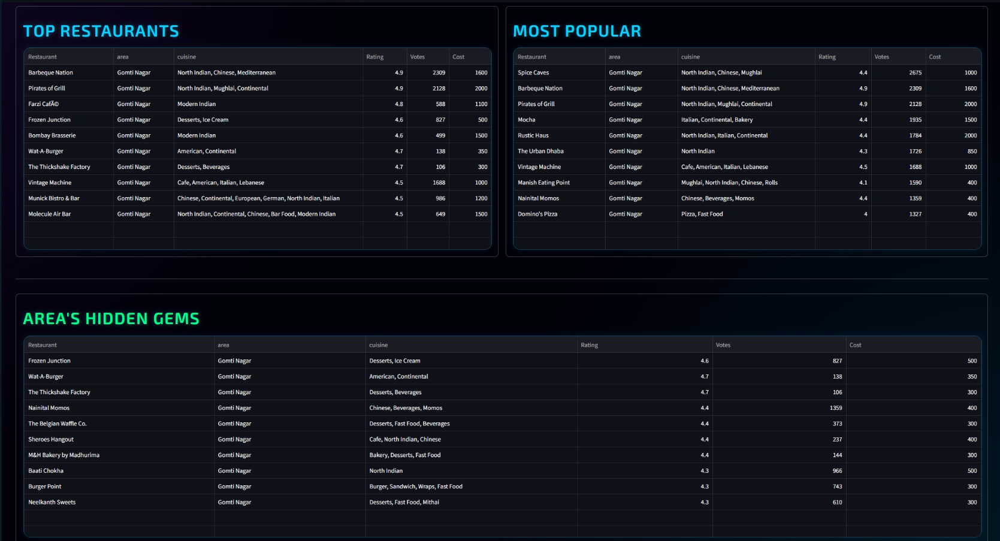
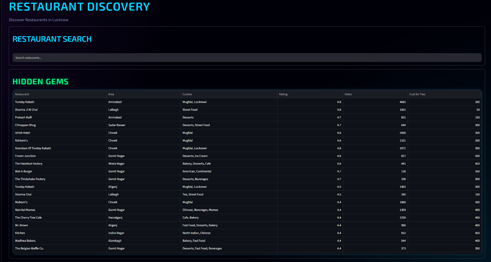
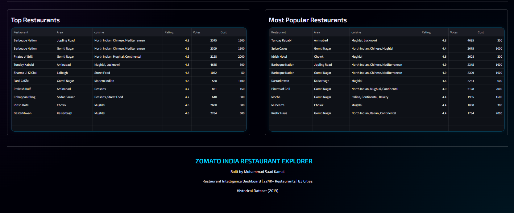

# Zomato India Restaurant Explorer

An interactive multi-city restaurant analytics dashboard built using Python, Pandas, Plotly, and Streamlit.


## Live Demo

https://indiarestaurantexplorer.streamlit.app/


## Project Overview

India Restaurant Explorer is a data analytics and visualization project that transforms raw restaurant data into actionable insights through an interactive dashboard.

The project analyzes over 224,000 restaurant records across 83 Indian cities and provides insights into restaurant trends, cuisine preferences, locality dynamics, pricing patterns, and restaurant discovery.

## Dataset

* Source: Kaggle Zomato India Restaurants Dataset
* Records: 220,866 cleaned restaurant records
* Cities Covered: 83
* Data Collection Year: 2019

## Dashboard Features

### City Overview

* Total Restaurants
* Average Rating
* Average Cost for Two
* Top Cuisine
* Cuisine Diversity

### Cuisine Analytics

* Top Cuisine Distribution
* Cuisine Popularity Analysis

### Locality Analytics

* Top Restaurant Areas
* Highest Rated Areas
* Most Expensive Areas

### Restaurant Discovery

* Hidden Gems Recommendation Engine
* Top Restaurants Leaderboard
* Most Popular Restaurants Leaderboard
* Restaurant Search Analytics

## Data Engineering Pipeline

Raw Excel Dataset

→ Data Audit

→ Data Cleaning

→ Data Validation

→ Parquet Dataset

→ Analytics Engine

→ Interactive Dashboard

## Cleaning Steps Implemented

* Removed invalid restaurant names
* Removed invalid datetime-based restaurant names
* Converted NEW ratings to missing values
* Converted zero ratings to missing values
* Converted zero cost values to missing values
* Standardized city names
* Standardized text columns
* Fixed mixed datatype issues
* Generated optimized Parquet dataset

## Analytics Engine

### Dataset Analytics

* Dataset Summary
* Missing Value Analysis
* Duplicate Analysis
* City Distribution Analysis

### KPI Analytics

* get_city_kpis()

### Cuisine Analytics

* get_top_cuisines()

### Locality Analytics

* get_top_localities()
* get_locality_cost_analysis()
* get_highest_rated_areas()

### Restaurant Discovery

* calculate_weighted_rating()
* get_hidden_gems()
* get_top_restaurants()
* get_most_popular_restaurants()
* search_restaurants()

## Project Structure

```text
zomato/

├── data/
│   ├── raw/
│   ├── processed/
│   └── reports/
│
├── app.py
├── analysis.py
├── data_cleaning.py
├── run_cleaning.py
├── styles.py
├── utils.py
├── config.py
│
├── requirements.txt
├── README.md
├── .gitignore
│
└── tests/
    ├── test_cleaning.py
    └── test_analytics.py
```

## Project Status

### Phase 1: Project Setup 
- Repository structure
- Configuration management
- Documentation
- GitHub setup

### Phase 2: Data Audit 
- Dataset summary
- Missing value analysis
- City distribution analysis
- Duplicate analysis

### Phase 3: Data Cleaning 
- Rating cleaning
- Cost cleaning
- Restaurant name validation
- Text standardization
- Parquet dataset generation

### Phase 4: Analytics Engine 
- City KPI generation
- Cuisine analytics
- Locality analytics
- Hidden Gems recommendation engine
- Weighted restaurant ranking
- Restaurant leaderboards
- Smart search functionality

### Phase 5: Dashboard Development 
- Multi-page dashboard architecture
- KPI cards and analytics panels
- Cuisine Insights dashboard
- Locality Analysis dashboard
- Restaurant Discovery dashboard
- Interactive restaurant search
- Plotly visualizations
- Responsive dashboard layout
- Custom Space-Themed UI
- Area Intelligence
- Area Restaurant Search
- Custom Space-Themed UI

### Phase 6: Deployment & Documentation 🚀
- README enhancement
- GitHub optimization
- Streamlit Cloud deployment
- Portfolio integration


## Future Enhancements

### Analytics
- City-to-city comparison mode
- Advanced cuisine recommendation engine
- Restaurant clustering analysis
- Trend forecasting dashboards

### Visualization
- Interactive geographic maps
- Heatmap-based locality intelligence
- Advanced filtering system

### User Experience
- Export analytics reports
- Download CSV/PDF summaries
- Personalized restaurant recommendations

### AI Integration
- AI-powered city insights
- Natural language restaurant search
- Automated analytics summaries


## Tech Stack

* Python
* Pandas
* NumPy
* Plotly
* Streamlit
* PyArrow
* OpenPyXL
* Git
* GitHub

## Current Progress

Project Completion Estimate: ~95%

Completed:
- Data Engineering Pipeline
- Data Cleaning Workflow
- Analytics Engine
- KPI Generation
- Cuisine Analytics
- Locality Analytics
- Hidden Gems Recommendation System
- Restaurant Discovery Engine
- Interactive Search
- Multi-Page Dashboard
- Custom Space-Themed UI
- Plotly Visualizations
- Dashboard Refactoring & Optimization

Current Focus:
- GitHub Documentation
- Streamlit Cloud Deployment
- Portfolio Presentation


## Dashboard Preview








